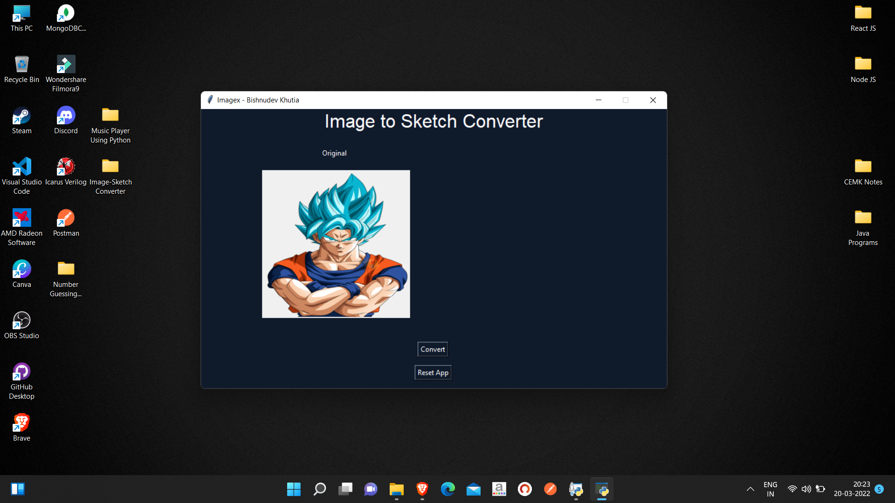
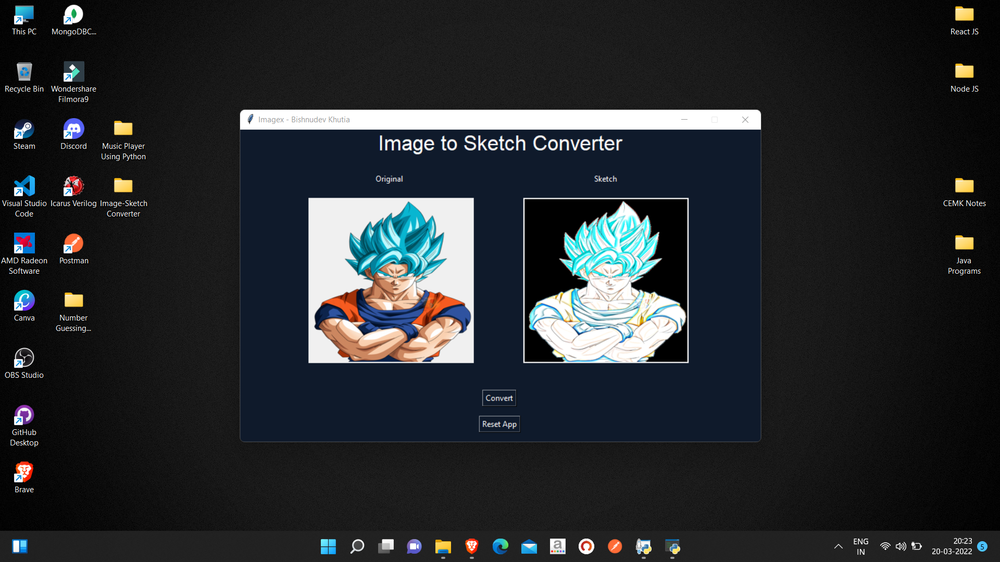

# Imagex
A Image to Sketch Converter App using Python

## Cons!!
- Only png Format is supported
- Need to upload image file in the root directory

## My Needs!!
- A way to upload more than one or one image files with a button 

 Before 

 After 

## Copyright
- Open Source

